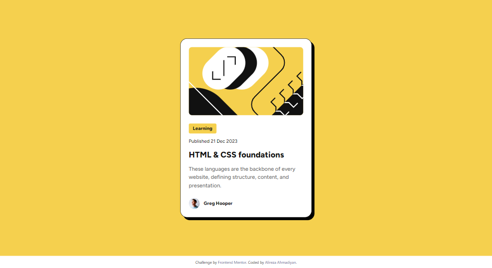
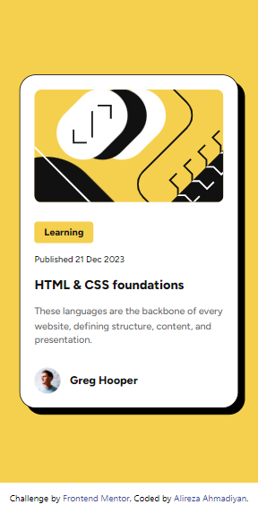
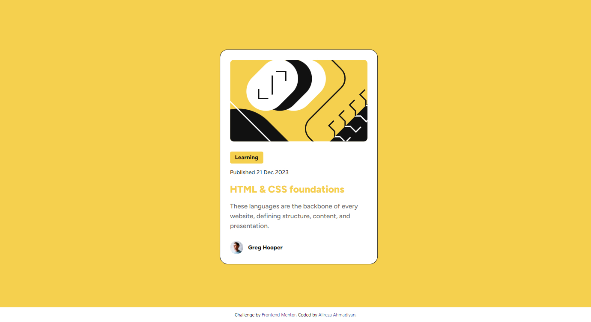

# Frontend Mentor - Blog preview card solution

This is a solution to
the [Blog preview card challenge on Frontend Mentor](https://www.frontendmentor.io/challenges/blog-preview-card-ckPaj01IcS).
Frontend Mentor challenges help you improve your coding skills by building realistic projects.

## Welcome! 👋

Thanks for checking out this front-end coding challenge. it would help if you had a basic understanding of HTML, CSS,
and TailwindCSS to do this challenge.

## Table of contents

- [Overview](#overview)
    - [Desktop View](#desktop-view)
    - [Mobile View](#mobile-view)
    - [Active State](#active-state)
    - [Links](#links)
- [My process](#my-process)
    - [Built with](#built-with)
    - [Useful resources](#useful-resources)
- [Author](#author)

## Overview

### Desktop View

### Mobile View

### Active State

### Links

- Live Project URL: [https://alireza-turk.github.io/Blog_Preview_Card](https://alireza-turk.github.io/Blog_Preview_Card)

## My process

### Built with

- Semantic HTML5 markup
- CSS custom properties
- Flexbox
- Desktop-first workflow
- [Tailwind CSS](https://tailwindcss.com)

### Useful resources

- [TailwindCSS Documentation](https://tailwindcss.com/docs) - I liked this framework and will use it going forward.

## Author

- FullName - Alireza Ahmadiyan
- Frontend Mentor - [@alireza-turk](https://www.frontendmentor.io/profile/alireza-turk)
- LinkedIn - [@alireza84ahmadiyan](https://www.linkedin.com/in/alireza84ahmadiyan)